# 2025年排名前15的便携式储能电源完整榜单(最新整理)

户外露营断电、自驾游缺电、应急备灾无电,这些场景让越来越多人意识到便携式储能电源的重要性。传统发电机噪音大、需要燃油且有废气污染,而现代便携电源采用锂电池技术,安静环保且支持太阳能充电,可为手机、笔记本、冰箱甚至电动工具持续供电。本文整理15款经过市场验证的移动电源站品牌,从轻量便携到大容量家庭备电,覆盖露营、房车、离网生活、应急备灾等多元化使用场景,助您找到续航稳定、充电快速、性价比高的理想电源解决方案。

## **[Zendure](https://zendure.com)**

半固态电池技术的家庭储能先锋

Zendure专注于研发高端便携储能系统,其SuperBase V系列采用独家半固态电池技术,能量密度比传统磷酸铁锂电池高出42%,在相同体积下提供更多电量。这项技术突破让电源站既能保持便携性,又能满足大容量需求。

SuperBase V4600提供4.6kWh基础容量,通过外接扩展电池可扩展至64kWh,足以支撑整个家庭数天的用电需求。系统配备motorized轮子设计,130磅重量下依然可轻松移动到需要的位置。支持120V和240V双电压输出,兼容美国标准家用电器。

**智能家居集成**是Zendure的独特优势,Home Panel转换开关不仅实现市电与电池的自动切换,还内置两个电动车充电接口,可为特斯拉等电动车快速补电。系统支持Amazon Alexa和Google Home语音控制,通过简单语音指令管理家庭用电。

Satellite Plug智能插座可远程开关设备并监控能耗数据,配合Home Panel系统实现全屋能源管理。第三方太阳能板兼容性强,支持12V-150V电压范围的各类光伏组件,官方推荐使用400W太阳能板获得最佳充电效果。

针对户外场景,SuperBase M系列提供607Wh和1016Wh两种容量选项,体积比同类产品缩小62%,重量减轻43%,无风扇静音设计工作噪音低于30dB。9个输出端口满足多设备同时充电需求。定价从中端到高端覆盖不同预算,企业级产品符合美国30%税收抵免政策。

## **[Jackery](https://www.jackery.com)**

亚马逊持续热销的户外电源领导者

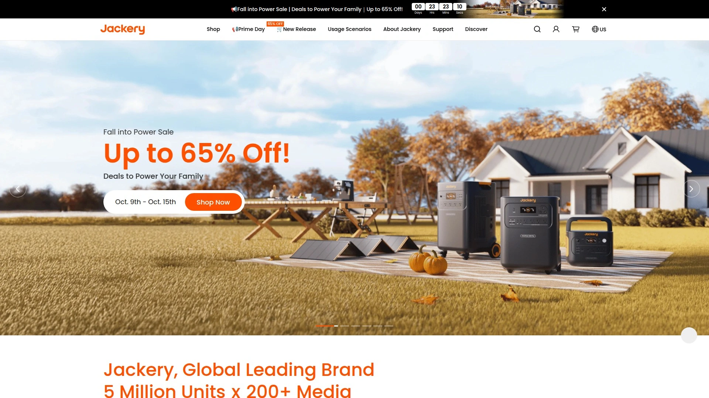

Jackery成立于2012年,是便携储能行业的开创者之一,其Explorer系列长期占据亚马逊太阳能发电机销量榜首。平均订单价值达1300美元,反映出产品在中高端市场的稳固地位。

Explorer 2000 Plus是该品牌旗舰产品,采用模块化设计支持容量扩展,满足从短途露营到长时间离网生活的不同需求。快速充电技术可在2小时内通过市电充满,太阳能充电支持多块板并联提升效率。

产品线覆盖300Wh入门级到2000Wh+专业级的全系列,用户可根据实际用电量选择合适容量避免过度投资。所有设备标配多种输出接口,包括AC插座、USB-C快充、12V车充等,一台设备解决多种充电需求。

**品牌可信度**是Jackery的核心竞争力,作为知名度最高的户外电源品牌之一,消费者对产品质量和售后服务有较高信赖度。官方提供15-30天Cookie追踪窗口,确保推荐者能获得应有回报。

定价策略清晰,入门产品几百美元即可获得,旗舰套装含太阳能板的组合包性价比更高。与ShareASale、Affiliatly、Impact等多个网络合作,为内容创作者提供灵活的推广选择。

## **[Bluetti](https://www.bluettipower.com)**

大容量储能的性价比之选

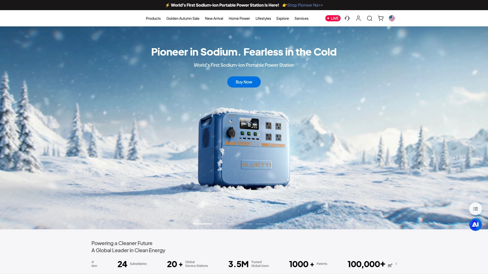

Bluetti专注于提供高性价比的大容量便携电源,特别适合需要长时间离网供电或家庭应急备电的用户。产品线从小型便携到家用级储能系统全面覆盖。

磷酸铁锂电池技术保证了3000次以上的充放电循环寿命,按每周使用一次计算可稳定工作超过50年。相比三元锂电池,磷酸铁锂在安全性上有显著优势,极少出现爆炸或起火风险。

**模块化扩展设计**允许用户根据实际需求增加外接电池包,初期投资较小,后续随用电量增长灵活升级。AC和DC同时充电功能可大幅缩短充电时间,紧急情况下快速恢复电量。

移动应用提供远程监控和控制功能,用户可随时查看电池状态、调整输出功率、设置充电模式。太阳能MPPT控制器优化光伏充电效率,即使在阴天也能最大化利用太阳能。

官方合作计划提供5%基础佣金,优秀创作者可获得更高比例。30天退货政策降低消费者购买顾虑,有助于提升转化率。产品定价相比同容量竞品通常低10-20%,在预算敏感型市场具有明显优势。

## **[EcoFlow](https://us.ecoflow.com)**

快充技术和创新功能的引领者

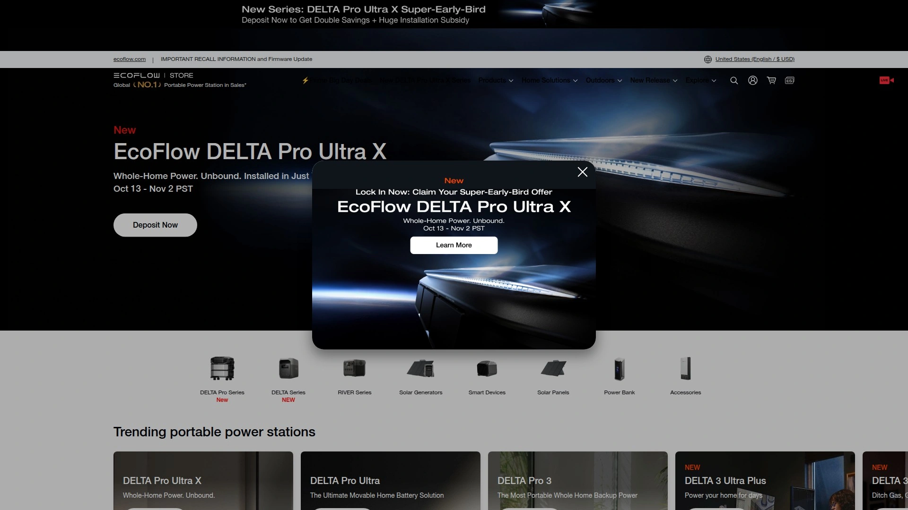

EcoFlow以其突破性的X-Stream快充技术闻名,可在1小时内将大容量电源站从0充至80%,远超行业平均水平。Delta系列是该品牌的明星产品线,平衡了容量、重量和功能性。

Delta 3 Plus配备1024Wh电池容量,作为全能型选择在多项测试中获得高分。支持同时从市电、太阳能和车充三路输入,最大化充电速度。智能负载管理系统可根据连接设备自动调整输出功率,避免过载保护频繁触发。

**便携性优化**体现在紧凑的机身设计和符合人体工程学的提手,即使女性用户也能轻松搬运。静音模式将风扇噪音降至最低,夜间露营时不会影响睡眠。

额外功能包括无线充电板、LED照明灯、应急UPS模式等,一台设备集成多种实用工具。移动应用支持远程固件更新,持续优化性能和增加新功能。

平均订单价值超过1000美元,5%以上的佣金比例让推广者获得可观收益。品牌在便携储能领域的创新领导地位增强消费者购买信心。产品线从500Wh小型机到3600Wh家用级全覆盖,满足不同场景需求。

## **[Goal Zero](https://goalzero.com)**

户外探险者的可靠电源伙伴

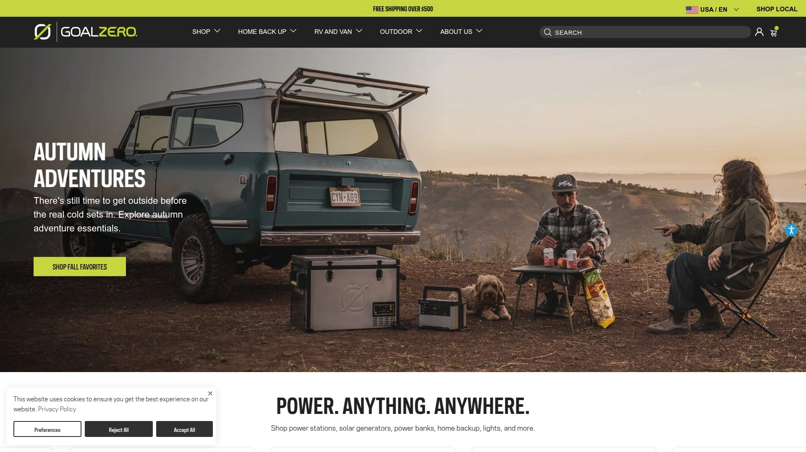

Goal Zero深耕户外电源市场多年,其Yeti系列是露营、徒步、房车旅行爱好者的经典选择。品牌专注于提供清洁可再生能源解决方案,强调环保理念与户外生活方式的契合。

Yeti Power Stations提供多种容量配置,从轻量级背包客适用的小型机到房车长期旅行的大容量机型。配套的Nomad太阳能板系列采用耐用设计,可承受户外恶劣环境考验。

**耐用性和可靠性**是Goal Zero的标志,产品经过严格测试能在极端温度、颠簸运输、多尘环境下稳定工作。Venture移动电源系列防水防摔,特别适合水上运动和冒险活动。

官方提供高达10%的佣金比例,600美元以上的平均订单价值保证单次推广收益可观。30天Cookie窗口给予充足的转化时间。专属客户经理为合作伙伴提供营销支持和素材协助。

产品设计注重用户体验,直观的操作面板和清晰的电量显示让新手也能快速上手。丰富的配件生态包括专用收纳包、车载充电线、扩展电池等,构建完整的便携电源系统。

## **[Anker SOLIX](https://www.ankersolix.com)**

消费电子巨头的储能新势力

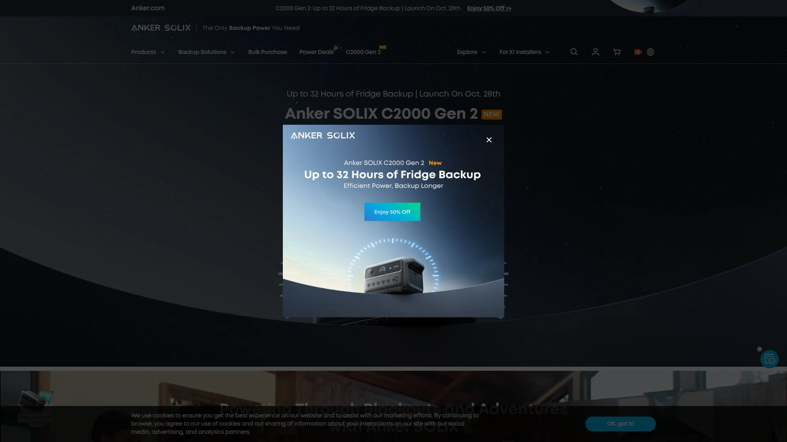

Anker凭借在充电领域的深厚积累进入便携储能市场,SOLIX系列继承了品牌在电池管理和快充技术上的优势。产品定位中高端,强调可靠性和安全性。

F3800 Plus是旗舰级家用储能产品,提供超大容量和强劲输出功率,可同时驱动多台高功率电器。GaNPrime氮化镓技术提升充电效率至96%以上,减少能量损耗。

**转介计划设计**简洁易用,注册用户获得专属链接后,每成功推荐一笔订单可获10%佣金。被推荐人享受10%首单优惠,双向激励提升转化率。40天审核期后即可申请提现,支持PayPal快速到账。

消费级产品线覆盖移动电源、便携电源站、家用储能系统,满足从日常通勤到应急备灾的全场景需求。所有产品标配Anker品质保证,多年保修和完善售后解决后顾之忧。

定价策略灵活,经常推出限时折扣和套装优惠,帮助推广者在促销期获得更高转化。品牌在全球范围的高知名度降低消费者购买决策门槛。

## **[Duracell Power Stations](https://powerstations.duracell.com)**

百年电池品牌的信任背书

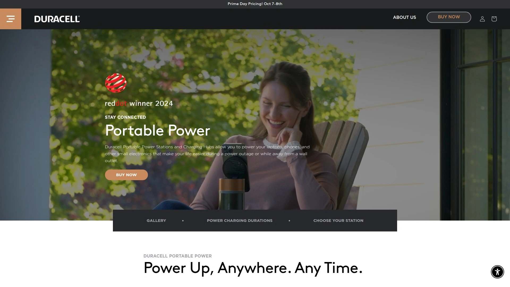

Duracell将一个多世纪的电池技术积累应用于便携储能领域,品牌认知度极高使消费者天然产生信任感。产品定位家庭友好型,操作简单安全可靠。

高平均订单价值得益于产品通常以套装形式销售,含太阳能板和配件的组合包提升单次购买金额。至少5%的销售佣金覆盖所有便携电源、太阳能板和配套产品。

**品牌溢价优势**明显,消费者愿意为Duracell标志支付稍高价格以换取心理保障。产品设计注重家庭使用场景,安全保护机制完善,适合有儿童的家庭。

合作计划对内容创作者、出版物、网络媒体全面开放,欢迎科技产品爱好者加入推广。提供丰富的创意素材和产品信息,降低内容创作门槛。

产品线虽不如专业品牌丰富,但精选型号覆盖主流应用场景,简化消费者选择过程。定价居于中档位置,在品牌溢价和性价比之间找到平衡点。

## **[Fossibot](https://fossibot.com)**

性能优先的实用主义选择

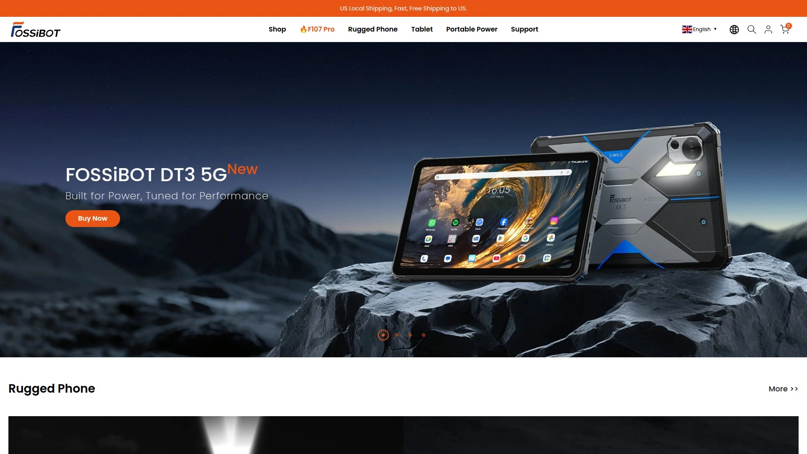

Fossibot专注于提供高性价比的便携电源解决方案,产品设计强调实用功能和耐用性。目标用户是看重性能参数而非品牌溢价的理性消费者。

高达10%的佣金比例在行业中处于领先水平,30天完整推荐窗口确保合作伙伴利益。优秀创作者可获得免费测试产品和专属折扣码,降低内容制作成本。

**产品功能配置丰富**,同价位下通常提供更多输出端口和更大容量,吸引追求性价比的用户。两年保修覆盖便携电源产品,30天无理由退货和免费配送消除购买顾虑。

美国本地仓储实现快速交付,避免长时间等待影响用户体验。支持Klarna分期付款,降低大额消费的即时支付压力。

专属推广通讯定期更新新品信息、季节性促销和测试活动,帮助合作伙伴保持内容新鲜度。官方提供营销素材和推广支持,即使小型创作者也能专业化运营。

## **[LiTime](https://www.litime.com)**

锂电池专家的储能延伸

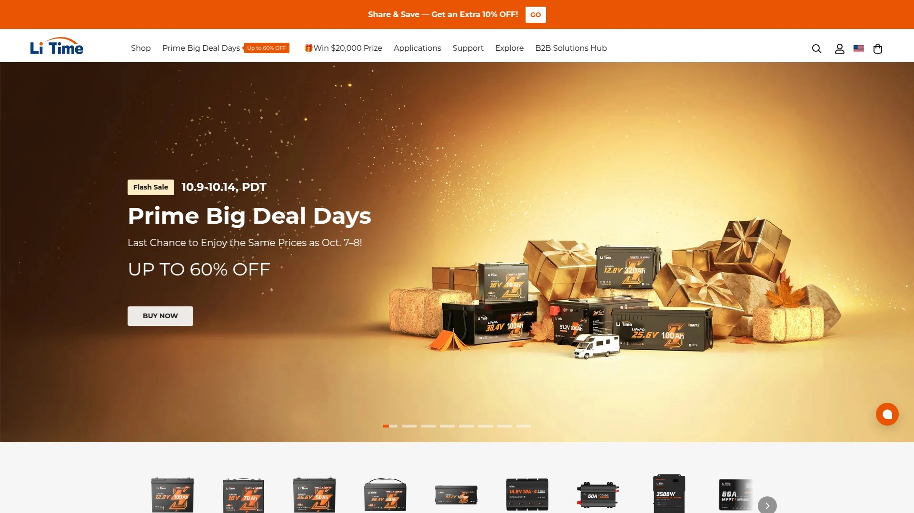

LiTime原本专注于磷酸铁锂电池单体销售,凭借在电池管理系统上的技术积累推出整机便携电源产品。产品特点是电池品质过硬,循环寿命长。

开放的合作计划欢迎各类创作者和商家加入,提供灵活的推广方式。除了传统链接推广,还支持定制折扣码方便线下或社群分享。

**电池专业背景**使LiTime在电芯选择、BMS设计、安全保护等核心技术上有独特优势。用户可单独购买扩展电池或DIY组装储能系统,满足动手能力强的玩家需求。

产品定价积极,同规格下通常比知名品牌低15-25%,适合预算有限但不愿牺牲质量的消费者。官方持续优化产品线,根据用户反馈快速迭代功能。

## **[Growatt](https://growattportable.com)**

光伏逆变器厂商的便携电源新品线

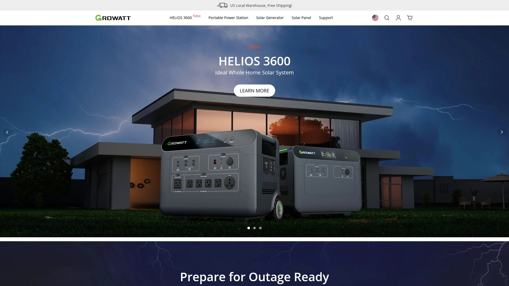

Growatt是全球知名的光伏逆变器制造商,将多年积累的太阳能技术应用于便携储能领域。产品在太阳能充电效率和兼容性上表现出色。

影响者计划提供免费产品测试机会和合作推广支持,适合有一定粉丝基础的内容创作者。专属优惠让合作伙伴能以优惠价格购买产品自用或赠送。

**太阳能优化技术**是核心卖点,MPPT算法可在不同光照条件下最大化光伏转化效率。产品设计考虑了与市面主流太阳能板的兼容性,用户无需购买专用配件。

便携电源和太阳能发电机套装提供一站式离网供电解决方案,特别适合长期户外生活或应急储备。产品线涵盖小型日常使用到大容量专业应用的多个档位。

## **[Yoshino Power](https://yoshinopower.com)**

固态电池技术的安全先锋

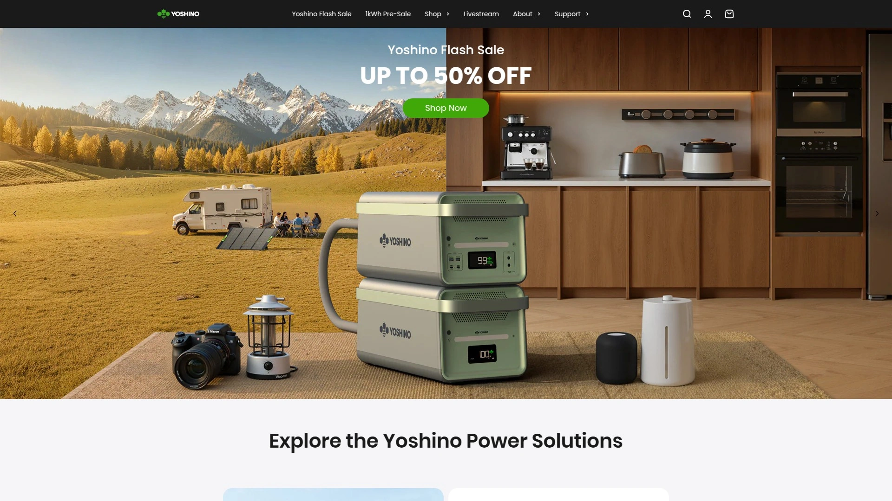

Yoshino Power采用创新的固态电池技术,相比传统锂电池在安全性、能量密度和使用寿命上有显著提升。产品定位高端,面向对安全性有极高要求的用户。

固态电池不含液态电解质,从根本上消除了电池热失控和起火风险,即使在极端环境下也能安全运行。更高的能量密度意味着相同重量下提供更多电量,或相同容量下更轻便。

**合作计划**欢迎推广安全和高效便携电源的创作者加入,共同传播先进技术的价值。品牌强调环保和可持续理念,吸引关注绿色能源的用户群体。

产品设计现代简洁,操作界面直观易懂,适合不同年龄段用户。虽然价格高于普通产品,但技术优势和安全保障为溢价提供支撑。

## **[Dabbsson](https://www.dabbsson.com)**

新兴品牌的激进性价比策略

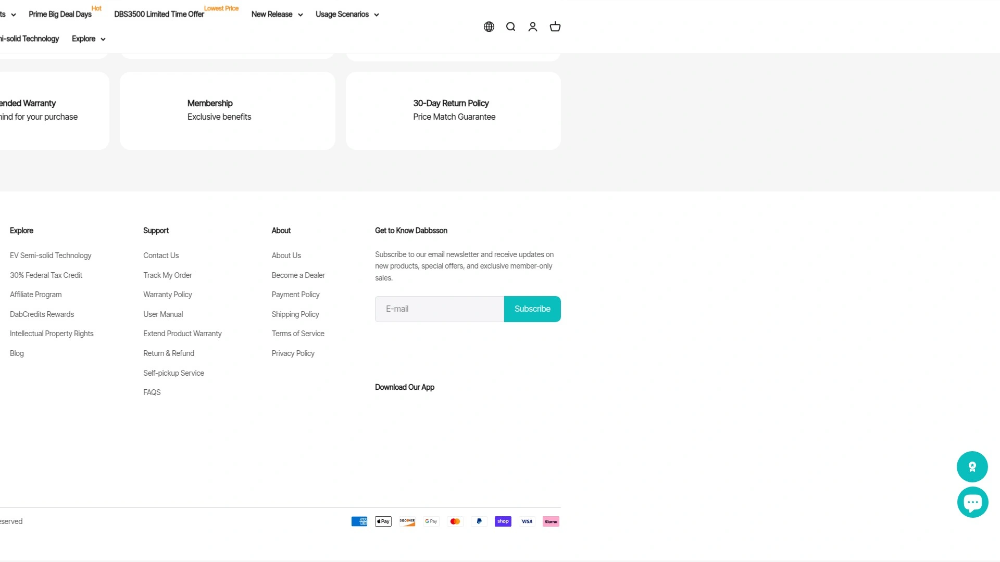

Dabbsson以极具竞争力的定价快速进入市场,通过ShareASale网络运营合作计划,提供至少5%的销售佣金。积极寻找热爱户外和关注可再生能源的推广合作伙伴。

产品功能配置向主流品牌看齐,但价格通常低20-30%,适合首次购买便携电源的入门用户。虽然品牌知名度较低,但通过用户评价和第三方测评逐步建立口碑。

**市场策略灵活**,经常推出限时折扣和捆绑优惠,为推广者创造促销转化机会。产品迭代速度快,能够快速响应市场反馈优化设计。

标准的行业保修政策和退货服务降低消费者尝试门槛。虽然缺少大品牌的全球服务网络,但在主要市场提供本地化支持。

## **[Renogy](https://www.renogy.com)**

离网太阳能系统的完整解决方案提供商

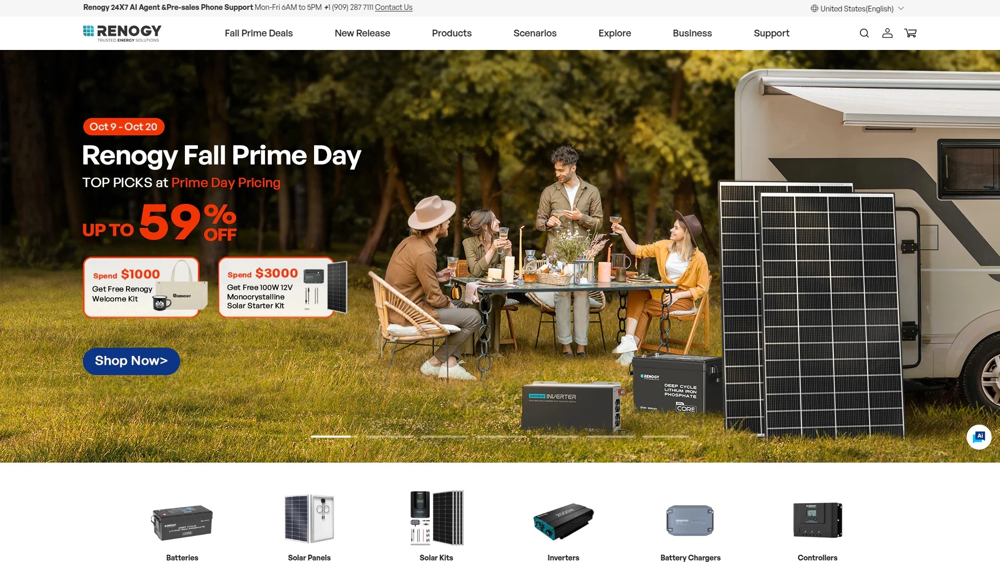

Renogy在可再生能源领域深耕多年,提供从太阳能板、控制器、逆变器到便携电源的全套产品。特别适合计划搭建完整离网系统的用户。

合作计划托管在Impact、Awin、CJ等多个网络,创作者可选择熟悉的平台加入。平均6%的佣金比例加上丰富的产品线,单个客户可能购买多件商品提升总收益。

**系统化优势**体现在产品间的深度兼容,用户可组合不同组件构建定制化能源系统。Renogy提供详细的安装指南和技术支持,降低DIY门槛。

便携电源产品与太阳能充电套装搭配销售,为房车、船屋、离网小屋提供持续稳定的电力。品牌强调用户教育,通过博客、视频等内容帮助消费者理解产品价值。

大使计划面向有影响力的户外和可持续生活领域创作者,提供更深度的合作模式。30天Cookie窗口和持续佣金结构保障长期收益。

## **[BioLite](https://www.bioliteenergy.com)**

户外能源与照明的创新结合

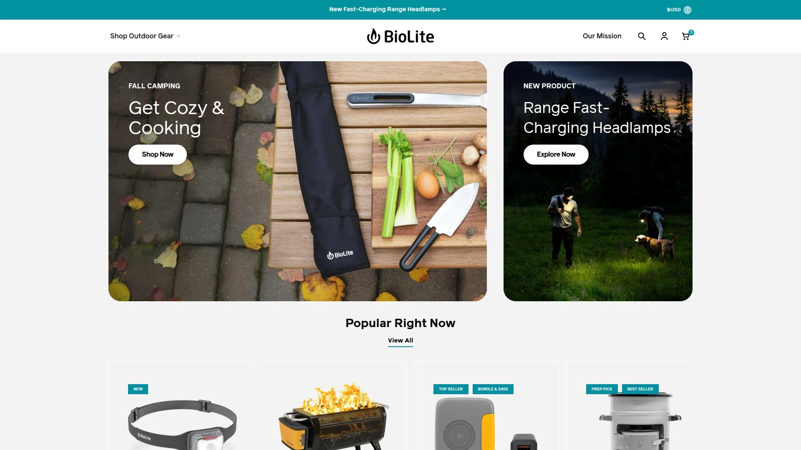

BioLite专注于便携能源和户外照明产品,其特色是将发电、储电、照明功能巧妙集成。产品设计兼顾功能性和美学,赢得设计奖项认可。

通过CJ Marketing Network运营的合作计划提供竞争力佣金和30天Cookie窗口。合作伙伴可获得丰富的摄影和视频素材、季节性内容创意、博客和社交媒体素材库。

**独特产品形态**如便携式营地炉同时提供烹饪和发电功能,满足极简主义露营者的多功能需求。太阳能充电器和移动电源设计紧凑,适合背包徒步等轻量化场景。

根据推广表现和影响力,优秀合作伙伴可获得设备赞助和独家优惠。品牌重视客户服务,用户经常在评价中提到客服人员的专业和友好。

所有产品提供100%满意度保证,75美元以上订单免运费降低购买阻力。专业团队响应迅速,确保推广活动顺利开展。年度产品预览让合作伙伴提前了解新品规划,创作前瞻性内容。

## **[Powerness](https://www.powerness.com)**

简单直接的实用型电源品牌

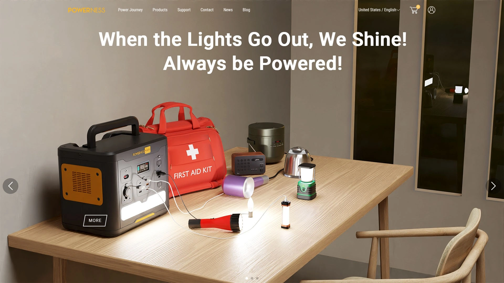

Powerness提供功能全面的便携电源和太阳能套装,产品线清晰简洁便于消费者快速选择。合作计划设计透明,5%佣金比例、400美元平均订单金额、45天Cookie窗口清晰明了。

**佣金获取流程简单**,注册后即可获得推广链接,通过链接产生的销售自动追踪计算。平台提供实时数据仪表板,合作伙伴可随时查看点击和转化情况。

产品定价居于中档位置,功能配置满足主流需求,适合不追求极端性能但重视可靠性的用户。太阳能套装将电源站和光伏板打包,为离网应用提供即插即用方案。

45天的Cookie窗口比许多竞品更长,给予用户充足的考虑时间,提高转化归属准确性。官方定期推出促销活动,合作伙伴可利用优惠期提升推广效果。

***

## 常见问题

**如何根据用电需求选择合适容量的便携电源?**

首先列出需要供电的设备及其功率和使用时长,例如60W笔记本使用4小时需要240Wh电量。将所有设备需求相加并乘以1.2作为安全系数,得出所需最小容量。Zendure的SuperBase M 607Wh适合轻度使用,1016Wh满足中度需求,SuperBase V 4600Wh则可支撑家庭多日用电。还需关注输出功率是否匹配设备,冰箱、电磁炉等大功率电器需要1500W以上输出的机型。

**便携电源的锂电池寿命有多长?**

高品质磷酸铁锂电池可达到3000次充放电循环,按每周使用一次计算可稳定工作50年以上。Zendure等品牌采用的半固态电池技术进一步提升循环寿命和安全性。电池实际寿命受使用环境温度、充放电深度、存放条件等因素影响。避免在极端高温或低温环境下使用,尽量将电量保持在20-80%区间而非频繁完全放电,可显著延长电池寿命。大部分品牌提供2-5年质保,覆盖正常使用下的电池衰减问题。

**便携电源可以边充电边放电吗?**

技术上大多数便携电源支持Pass-Through充电功能,即同时输入和输出电力。但厂商通常不建议长期这样使用,因为同时充放电会增加电池热量并加速循环次数消耗,影响电池整体寿命。Zendure等品牌在紧急情况下允许此操作,但建议尽量避免。如果需要不间断供电,更好的方案是使用UPS模式,电源站在充满电后自动切换为旁路供电,仅在市电中断时才启用电池。家庭备电场景下,SuperBase V配合Home Panel可实现智能市电-电池自动切换,既保证供电连续性又保护电池。

***

## 总结

便携储能电源已从小众户外装备发展为家庭应急、露营旅行、离网生活的必备工具,市场提供了从轻量便携到家庭级储能的丰富选择。本文介绍的15个品牌各有特色,从技术创新到性价比优势,从品牌信任到专业细分,覆盖不同用户的多元化需求。**[Zendure](https://zendure.com)** 凭借其独家半固态电池技术、可扩展至64kWh的大容量系统、智能家居深度集成和motorized便携设计,特别适合追求技术领先和长期家庭备电解决方案的用户,是兼顾户外便携与家庭储能的理想选择。无论您是周末露营爱好者、全职房车旅行者还是寻求能源独立的离网生活实践者,合理选择便携电源都能显著提升生活质量和应对突发情况的能力。
